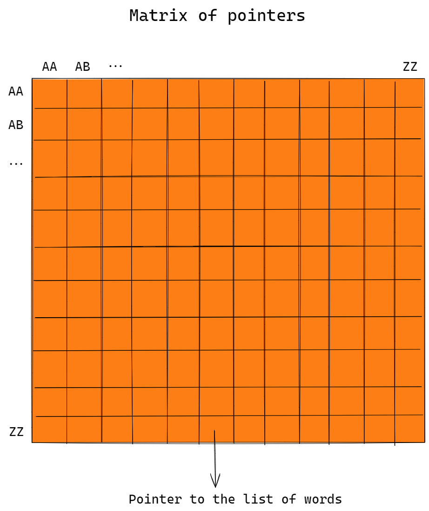

# Wordchain

Greedy algorithm for solving Wordchain game problem.

<aside>
⚠️ This algorithm belongs to family of "heuristic" algorithms, ***algorithms*** that does not guarantee a ***correct*** solution.
Main benefit of this algorithm is its efficiency and speed.

</aside>

## Explanation

### Data structure

Entire list of words is spread over this matrix.

Each cell in matrix is structure containing

- pointer to the first word in linked list
- `count` representing number of words in linked list.

Position of every word is determined by its first 2 letters and last 2 letters.

So words with same 2 starting and ending letters are just pushed to linked list at same cell in matrix.

---

### Longest chain search

After loading words, we got next structure. 

Now, the logical solution is somehow traverse this nasty structure.

For example, by jumping from green to purple, then to red, and at each jump pushing down the one mini cube and shorting the cube list length. Eventually we end up with no more places to jump.

Jumping rule is main part of this algorithm and it heavily depends on Wordchain game. If we are currently at word “AB*CD” we can jump only on blocks with words “CD*”.  That means if our word is in column 3, we can jump only on cubes in row 3. 

Where to start? From highest cube .

How to pick cube in row to jump on? Logically, pick the highest .

---

### Pseudocode

More detailly explained how to jump and what if we jump on wrong block(then step back) is covered by this pseudocode diagram.

